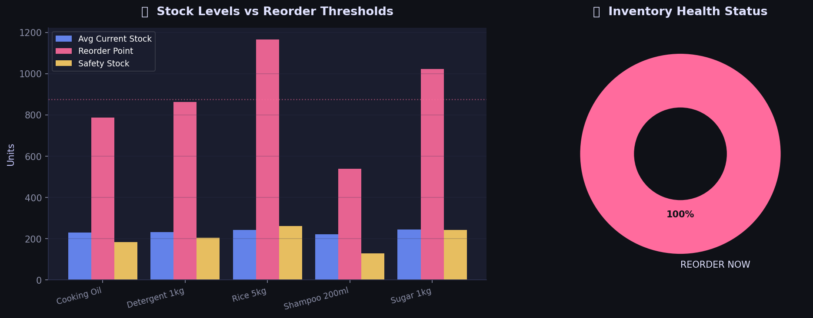

# 📦 Retail Sales Forecasting & Inventory Optimization System

A data science project that analyzes retail sales data, forecasts future demand using Machine Learning, and generates inventory optimization recommendations.

---

## 📊 Project Overview

| Item | Details |
|---|---|
| Dataset | Synthetic — 525 weekly records, 5 products, 2 years |
| Model | Linear Regression |
| Best R² Score | 0.923 (Rice 5kg) |
| Libraries | pandas, numpy, matplotlib, seaborn, scikit-learn |

---

## 🔍 What This Project Does

- Generates realistic retail sales data with seasonality and trend
- Performs full EDA across 5 product categories
- Trains individual forecasting models per product
- Calculates safety stock and reorder points using industry formulas
- Flags which products need immediate restocking

---

## 📈 Output Charts

### Sales Trend (All Products)


### Product Revenue Comparison


### Monthly Seasonality Heatmap


### Forecast — Actual vs Predicted


### Inventory Health Dashboard


---

## 🛠️ Tech Stack

- Python 3.x
- Pandas, NumPy
- Matplotlib, Seaborn
- Scikit-learn

---

## ▶️ How to Run

```bash
